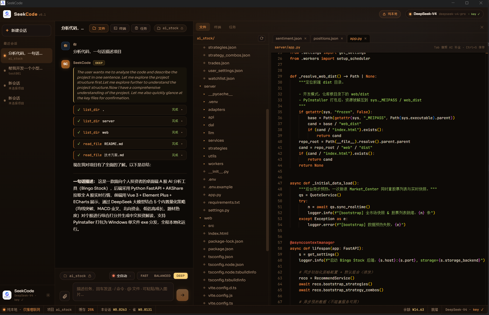

<div align="center">


# SeekCode

### 桌面客户端 · 本地 Agent · 由 DeepSeek-V4 驱动的 AI 编程工具

**A desktop AI coding agent that runs locally on your machine — powered by DeepSeek-V4.**

[](LICENSE)
[](#构建与打包)
[](https://www.electronjs.org/)
[](https://react.dev/)
[](https://www.typescriptlang.org/)
[](https://www.deepseek.com/)
[](#贡献)
[](https://github.com/kafkazhang/seek_code/stargazers)

融合 **Claude Code**（本地结对深度）与 **Codex**（任务委派）思路，基于 **Electron + Node + React/TypeScript** 构建的**桌面客户端** AI 编程工具。
Agent **在你本机运行工具循环**，深度适配 **DeepSeek-V4** 的混合推理档位与前缀缓存特性。
集成 **Agent 工具循环、本地代码索引检索、记忆系统、Skills / MCP 扩展、内置终端与编辑器**——零后端，粘贴一个 API Key 即用。

[快速开始](#快速开始) · [核心能力](#核心能力) · [扩展生态](#扩展生态skills--mcp--市场) · [模型与协议](#模型与协议deepseek-v4) · [Roadmap](#roadmap) · [贡献](#贡献)

</div>

---

<div align="center">



</div>

## 为什么选择 SeekCode？

| | SeekCode | 云端 / 插件式 AI 编程工具 |
| --- | --- | --- |
| 🖥️ 形态 | **桌面客户端**，Agent 在本机运行多步工具循环；文件树 / 终端 / 编辑器一体 | 多为网页 / 编辑器插件 |
| 🎚️ 模型适配 | **深度适配 DeepSeek-V4**：混合推理三档 + thinking 解耦 + 前缀缓存 | 通用接入，未针对单模型优化 |
| 💰 成本 | 仅按 DeepSeek API 计费，**实时透明展示花费 / 缓存命中 / 省下金额** | 订阅制 / 不透明计费 |
| 🧩 可扩展 | 内置 **Skills / MCP / 扩展市场**，按需安装 | 取决于平台 |
| 🗂️ 代码理解 | **本地 BM25 索引 + 符号大纲**（离线零依赖），可选语义向量混合召回 | 多依赖云端向量库 |
| 🔑 上手 | 粘贴一个 API Key 即用，**零后端** | 需注册 / 登录 / 配置 |

> 一句话：**想要一个跑在自己机器上、深度适配 DeepSeek-V4 的桌面 Agent 编程工具，SeekCode 就是为你准备的。**

## 核心能力

### 🧠 Agent 工具循环（本机执行）
- 流式对话 + 多步工具循环（单回合最多 25 步，自动推进直至任务真正完成）
- 工具集：`read_file`（行号区间分段读）/ `list_dir` / `grep`（glob 过滤 + 上下文行）/ `find_files` / `file_outline` / `find_definition` / `find_references` / `search_code` / `write_file` / `edit_file` / `multi_edit` / `run_command` / `run_background` / `bg_output` / `bg_kill` / `project_check` / `todo_write` / `web_fetch` / `list_skills` / `read_skill` / `spawn_subagents`，外加按需挂载的 MCP 工具
- **任务清单（todo_write）**：多步任务先列清单、逐项推进并实时更新状态，聊天区常驻清单卡可见进度——防跑偏、防漏步骤
- **后台进程**：`run_background` 启动 dev server / watch 等常驻命令（不阻塞回合），`bg_output` 轮询日志、`bg_kill` 收尾，支撑「起服务 → 验证 → 改代码 → 再验证」的真实开发闭环；应用退出自动清理
- **子代理 / 多代理协作编排**：Agent 可用 `spawn_subagents` 把互相独立的子任务并行委派给最多 6 个子代理（3 个并发）。子代理继承会话权限模式、审批上浮到主对话、花费计入会话成本，进度卡在聊天内实时展示；子代理不可再派生（防递归）

### 🛠️ 工具侧补强模型编程短板
- **符号导航（AST-lite，零依赖离线）**：`find_definition` 按语言规则识别定义行、`find_references` 词边界找全引用并按文件分组标注定义——改签名/重命名前先找全调用点，杜绝漏改；倒排索引预过滤候选文件，免全库扫描
- **受控联网（web_fetch）**：查报错含义 / 库 API 文档时可读取网页转纯文本。**任何模式（含全自动）每个新 host 都强制弹审批**，批准后才注册进「用户显式信任」出口白名单；只发 GET、不携带任何用户代码。检测到**纯 JS 渲染的 SPA 空壳**时，自动用内置 Chromium 的**隐藏沙箱窗口**渲染后提取正文（内存级独立会话、无 Node/preload、拒绝弹窗/下载/权限、屏蔽图片字体媒体、用完即毁并清空存储），零额外依赖
- **编辑自纠**：`edit_file` 精确匹配失败时自动做**忽略缩进的容错匹配**；仍失败则返回文件中**最相近片段**（带行号）帮模型修正，杜绝"凭记忆盲改"；支持 `replace_all`
- **原子批量编辑**：`multi_edit` 对同一文件一次应用多处修改，任何一处失败整体不生效，避免半截改动污染文件
- **写入即体检**：写入/编辑后即时反馈**变更区域回显** + 轻量语法体检（JSON 真实解析、忽略字符串/注释的括号平衡扫描），低级错误当场暴露
- **自检闭环**：`project_check` 自动探测项目质量门（package.json 的 typecheck/lint/test、`cargo check`、`go vet`，自动跳过 watch 类脚本）一键运行，系统提示要求**验证通过才算完成**
- **防卡死**：同名同参的工具调用连续失败时，自动注入"换方法"提示（重读文件 / 改用 multi_edit / 整体重写），打断无效重试循环
- **瞬时错误自动重试**：流式请求遇限流 / 5xx / 网络抖动时指数退避重试，长链路任务更稳
- **上下文自动压缩**：会话过长时用 fast 档把早期对话摘要为要点，仅在 user 消息边界裁剪，不破坏工具调用配对
- **防"光说不做"**：模型只宣布计划却未动手时自动催办，强制其真正调用工具落地

### 🎚️ 混合推理档位（DeepSeek-V4）
| 档位 | 模型 | thinking | 适用 |
| --- | --- | --- | --- |
| **FAST** | `deepseek-v4-flash` | 关闭 | 最快最省，简单改动 |
| **BALANCED** | `deepseek-v4-pro` | `high` | 日常默认 |
| **DEEP** | `deepseek-v4-pro` | `max` | 复杂推理 / 架构 |

含思维链展示；V4 起 thinking 与 tools/temperature 解耦，**三档均支持工具调用**。

### 💰 缓存优先 + 成本透明
- 系统提示与项目代码地图作为**稳定前缀**复用，稳定命中 DeepSeek 服务端前缀缓存
- 实时展示缓存命中率、本会话花费与相比无缓存**省下的金额**
- 内置 DeepSeek 账户余额查询

### 🔐 四档权限模式（参考 Claude Code）
- **询问授权 `ask`**：每次写文件 / 执行命令都需确认（默认）
- **接受编辑 `acceptEdits`**：自动写文件，命令仍需确认
- **计划模式 `plan`**：只读分析，先产出实施方案再动手
- **全自动 `auto`**：写入与命令全部自动放行
- 写入操作附带 **diff 预览审查**；`rm -rf` / `shutdown` 等**危险命令即使全自动也强制弹审批**；按名批量杀 `node`/`electron` 的"自杀命令"直接硬拒绝

### 🗂️ 本地代码索引（BM25 离线 · 语义向量可选）
- **符号大纲**（AST-lite 正则提取 function/class/type…）→ 注入"代码地图"，让模型秒懂项目结构
- **BM25 词法倒排索引** → `search_code` 工具做检索式 RAG，大项目里优先定位而非逐个读文件
- **语义向量混合召回（可选）**：设置中开启后，代码按行分块经 OpenAI 兼容 `/embeddings` 向量化，检索时 BM25 与向量两路排名做 **RRF 融合**；向量按内容哈希落盘缓存、文件变更只增量重嵌，未配置/接口不可用时自动回退纯 BM25。DeepSeek 暂无向量模型，故**向量服务单独配置**（Base URL + API Key + 模型 id，密钥独立加密存储、出口白名单自动同步），默认接入**阿里 DashScope · `text-embedding-v3`**
- 索引**持久化落盘 + 按 mtime 增量更新 + 文件监听**，重启免重建；大项目自动提示模型优先检索

### 🧩 记忆系统
- **项目记忆 `SEEK.md`**：随项目根目录存放，可随仓库提交、团队共享（兼容 `CLAUDE.md`）
- **全局记忆**：跨项目的用户偏好
- 对话中 `/remember …` 一句话写入记忆，每次对话自动注入上下文

### 🖼️ 本地 OCR 识图
- 粘贴/附带截图时，用内置 `tesseract.js`（中文 + 英文字库随包内置）**本地识别文字**再拼进 prompt
- 完全离线，不依赖任何视觉接口

### 🌿 内置 Git 面板与变更评审
- 右侧「Git」标签页：分支与领先/落后状态、**暂存 / 未暂存分组**的变更列表，单文件 / 全部一键暂存、取消暂存、丢弃改动（带确认）
- 点击文件即看 **Monaco diff**（HEAD ↔ 暂存区 / 暂存区 ↔ 工作区），提交历史一键切换
- **AI 生成提交信息**：基于暂存区 diff 用 fast 档产出 Conventional Commits 中文提交信息
- **AI 变更评审**：对全部变更（含未跟踪新文件）产出结构化评审报告（总体评价 / 问题按严重度 / 建议）
- 主进程 `execFile` 直调本机 git（参数数组、无 shell 注入面），所有操作限定项目根目录

### 🖥️ 内置终端 & 编辑器
- 内置流式终端面板（Windows 走 PowerShell 并强制 UTF-8 杜绝中文乱码 / Unix 走默认 shell），支持会话环境变量、`cd` 跟踪与 stdin 交互
- Monaco 编辑器 + 行内 / 并排 **Diff 视图**，文件树浏览、文件预览、HTML 一键预览
- 多会话管理、命令面板、`@` 文件引用、斜杠命令（`/fast` `/deep` `/plan` `/cost` `/memory` `/remember` `/clear` …）、5 套主题

### ⚙️ 后台任务（任务委派）
- 把目标委派给后台**自主 Agent**（auto 权限）并发执行，与前台对话互不阻塞
- 队列化（限制并发数）、**持久化落盘**、完成时系统通知；重启后恢复任务列表

## 扩展生态（Skills / MCP / 市场）

### Skills 技能
- 技能 = 目录 + `SKILL.md`（与 Claude Code / Kiro 一致），分**全局** / **项目**两级
- 支持从 **GitHub 目录 / 单文件 URL 一键安装**、记录来源后**一键更新**、**扫描仓库自动发现**其中所有技能
- 内置 `code-review` / `commit-message` 等示例，模型可 `list_skills` / `read_skill` 按需加载工作流

### MCP（Model Context Protocol）
- 同时支持 **stdio 本地子进程**与 **Streamable HTTP 远程**两种传输
- 配置 `<project>/.seek/mcp.json` 或全局 `mcp.json`，连接后工具自动注入 Agent
- 远程 MCP 服务器需用户显式配置后才会连接

### 内置扩展市场（搜索式在线安装）
- 内置常用 MCP 目录：`filesystem` / `memory` / `sequential-thinking` / `github` / `brave-search` / `puppeteer` / `context7` 等
- 在线搜索：官方 **MCP Registry** + **GitHub 技能仓库**，搜到即可一键安装

## 快速开始

前置：**Node.js ≥ 18**。

```bash
git clone https://github.com/kafkazhang/seek_code.git
cd seek_code
npm install        # 纯 JS 依赖，无需原生编译工具链
npm run dev        # 启动开发模式（electron-vite）
```

首次启动会弹出配置框：

1. 粘贴 **DeepSeek API Key**（默认接口 `https://api.deepseek.com`）
2. 点「测试连接」确认可用 →「保存并开始」
3. 点标题栏「打开项目文件夹…」选择一个本地项目
4. 在底部输入框提问，例如："梳理这个项目的整体结构"

## 开发与质量

```bash
npm run typecheck      # 类型检查（Node 端 + Web 端）
npm run lint           # ESLint（扁平配置，覆盖主/渲染层）
npm test               # Vitest 单元测试
npm run format         # Prettier 格式化（可选，本地使用）
```

> CI（`.github/workflows/ci.yml`）在 PR / 主分支推送时跑 **typecheck + lint + test** 作为质量门。

## 构建与打包

```bash
npm run build          # 编译主/预加载/渲染三端到 out/
npm run package:win    # 打 Windows 安装包
npm run package:mac    # macOS（支持 --x64 / --arm64）
npm run package:linux  # Linux（AppImage）
```

## 项目结构

```
src/
  main/        # 主进程（Node）
    index.ts        应用入口、窗口与运行配置
    config.ts       配置与 API Key（safeStorage 加密）
    gateway.ts      DeepSeek 网关 + 缓存优先 Prompt + 成本核算 + FIM 补全
    retry.ts        瞬时错误重试 / 指数退避（纯逻辑）
    agent.ts        Agent 循环（流式 + 工具调用 + 权限闸门 + 上下文压缩）
    subagents.ts    子代理编排（并发委派 + 审批上浮 + 进度事件）
    tools.ts        文件/命令工具（限定项目目录内）
    editing.ts      编辑纯逻辑：容错匹配/批量编辑/语法体检/glob/大纲（纯逻辑）
    checks.ts       项目质量门探测（typecheck/lint/test，纯逻辑）
    symbols.ts      符号导航：定义行识别/词边界引用（纯逻辑）
    todos.ts        任务清单 todo_write（纯逻辑）
    bgproc.ts       后台进程（run_background/bg_output/bg_kill）
    webfetch.ts     受控联网读取（强制审批 + 信任出口注册）
    htmltext.ts     HTML 转纯文本（纯逻辑）
    cmdsafety.ts    命令安全分类（危险/自杀命令识别，纯逻辑）
    codeindex.ts    本地代码索引：符号大纲 + BM25 检索（持久化/增量/监听）
    hybrid.ts       混合召回纯逻辑：分块 / 余弦 / RRF 融合（纯逻辑）
    vecindex.ts     语义向量索引（embedding 缓存 / 增量 / 混合检索入口）
    git.ts          Git 面板（status/diff/stage/commit + AI 提交信息与评审）
    gitparse.ts     git 输出解析（porcelain/log，纯逻辑）
    memory.ts       记忆系统（SEEK.md / 全局）
    skills.ts       技能：扫描 / 安装 / 更新 / 仓库发现
    mcp.ts          MCP 客户端（stdio + Streamable HTTP）
    marketplace.ts  扩展市场（内置目录 + 在线搜索安装）
    tasks.ts        后台任务（并发自主 Agent + 队列 + 持久化）
    terminal.ts     内置终端（流式、UTF-8、stdin 交互）
    ocr.ts          本地 OCR 识图（tesseract.js）
    sessions.ts     会话持久化
    egress.ts       应用出口白名单 + 主进程受控 fetch（guardedFetch）
    net.ts          渲染层出口白名单（webRequest 拦截）
    ipc.ts          IPC 处理 + 项目文件树 + 审批往返
  preload/     # 预加载（contextBridge 安全桥）
  renderer/    # 渲染进程（React + TS）：对话、编辑器、终端、文件树、市场、设置、成本仪表盘
  shared/      # 主/渲染共享的类型与 IPC 常量
```

## 模型与协议（DeepSeek-V4）

- 默认模型 `deepseek-v4-flash` / `deepseek-v4-pro`，采用 **OpenAI 兼容协议**，仅需 `baseURL` + `apiKey`，可在设置里热切换接口地址与模型名。
- 思考深度通过请求体 `thinking` 参数控制：`{ "type": "enabled"|"disabled", "reasoning_effort": "high"|"max" }`。
- **V4 起 thinking 与 tools/temperature 解耦**——三档推理均可带工具；`frequency_penalty`/`presence_penalty` 已弃用。
- **缓存优先**：系统提示与代码地图作为稳定前缀复用，稳定命中服务端前缀缓存以省成本。
- 旧名 `deepseek-chat` / `deepseek-reasoner` 将于 2026-07-24 弃用。

## 本地运行与权限

- Agent 全程**在本机运行**；文件工具一律限定在当前项目根目录内，拒绝目录穿越。
- 四档权限模式 + 写入 diff 预览 + 危险命令强制审批（见[核心能力](#核心能力)）。
- 渲染进程开启 `contextIsolation` / 关闭 `nodeIntegration` / `sandbox: true`，仅通过白名单 IPC 与主进程通信。
- API Key 经操作系统级 `safeStorage` 加密保存于 userData，卸载即清除。
- 应用自身默认仅与 DeepSeek 通信，安装扩展时访问少数公共只读源（GitHub / MCP 注册中心等）；代码索引与 OCR 均在本机完成。

## Roadmap

- [ ] 多模型供应商支持（OpenAI 兼容接口热插拔）
- [x] 代码库语义向量检索（与现有 BM25 混合召回）
- [x] 子代理 / 多代理协作编排
- [ ] 更丰富的扩展市场与一键分享
- [x] 内置 Git 面板与变更评审

> 有想法？欢迎到 [Issues](https://github.com/kafkazhang/seek_code/issues) 提建议。

## 常见问题（FAQ）

**Q：它和云端 / 插件式 AI 编程工具有什么不同？**
A：SeekCode 是**桌面客户端**，Agent 在你本机运行多步工具循环（读写文件、跑命令、检索代码），文件树 / 终端 / 编辑器一体；并针对 **DeepSeek-V4** 的混合推理与前缀缓存做了深度适配。

**Q：需要自己搭后端吗？**
A：不需要。SeekCode 是纯桌面应用，零后端，只需一个 DeepSeek API Key。

**Q：大型项目会不会把整个代码库塞进 prompt？**
A：不会。本地 BM25 索引 + 符号大纲只注入"代码地图"，正文按需检索；项目较大时还会提示模型优先用 `search_code` 定位。

**Q：支持哪些平台？**
A：Windows / macOS / Linux 均可构建打包。

**Q：我的代码会上传吗？**
A：应用自身默认只与 DeepSeek 通信（你的提问与上下文），代码索引与识图均在本机完成。注意：你或 Agent 通过终端 / `run_command` 执行的命令（如 `git push`、`npm publish`）属于你主动发起的正常开发操作。

## 贡献

欢迎任何形式的贡献——提 Issue、提 PR、完善文档或分享使用体验。

1. Fork 本仓库
2. 新建分支：`git checkout -b feat/your-feature`
3. 提交并推送，发起 Pull Request

如果这个项目对你有帮助，欢迎点一个 ⭐ **Star** 支持一下！

## 许可证

本项目采用 [MIT License](LICENSE) 开源。

Copyright © 2026 SeekCode

「SeekCode」名称与标识仅用于指代本项目，不等同于对商标或商业品牌的额外授权。

联系作者：


